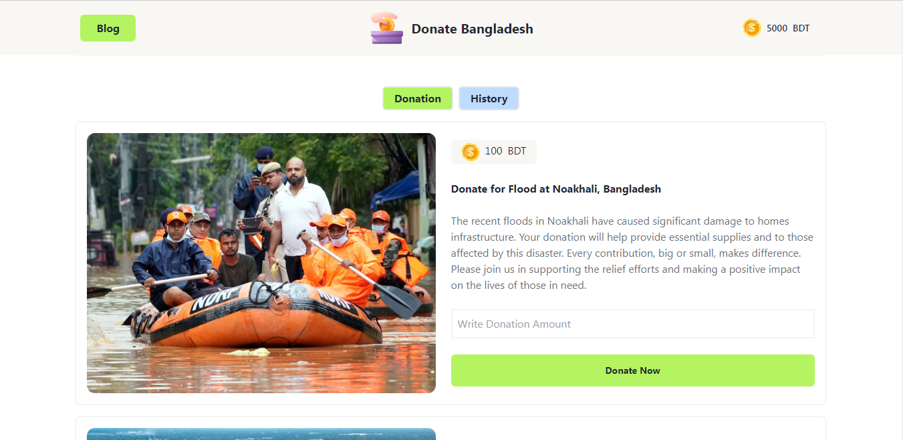

# Donate Bangladesh 🇧🇩

Donate Bangladesh is a simple donation platform where donations can be made for various humanitarian causes.
This project is frontend-based and has been developed using HTML, JavaScript, Tailwind CSS, and DaisyUI.

## 🔗 Live Preview
https://mominulislam1234423.github.io/Donate-Bangladesh/

## ✨ Features
- 💚 Multiple donation campaigns
- 💸 Donate amount input system
- 📜 Donation history tracking
- 📱 Fully responsive design
- 🎨 Clean & modern UI using Tailwind CSS + DaisyUI

## 🛠️ Technologies Used
- **HTML5**
- **JavaScript (Vanilla JS)**
- **Tailwind CSS**
- **DaisyUI**

## 📂 Project Structure

